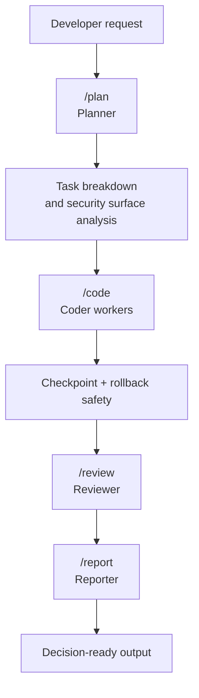

# Secure Coding Agent


[](https://github.com/raomaster/secure-coding-agent/actions/workflows/ci.yml)


**A security-first orchestration layer for AI coding agents.**

Secure Coding Agent turns subscription-based coding CLIs into a structured secure development workflow with planning, implementation, review, reporting, and rollback built in.

- Coordinate **Claude, Gemini, and Codex** through explicit roles instead of ad hoc prompting.
- Keep security **inside the development workflow**, not as a disconnected afterthought.
- Install a reproducible workflow with **config, commands, checkpoints, CI validation, and docs**.

## Why this exists

AI-assisted development is productive, but the default workflow is still weak:

- prompts are inconsistent
- model roles are implicit
- security review is often bolted on too late
- rollback and reproducibility are usually missing

Secure Coding Agent exists to answer a specific problem:

> How do you turn AI coding CLIs into a disciplined, security-aware workflow that is usable by real engineers?

This project treats AI-assisted development as a systems problem:
- role orchestration
- safe defaults
- reproducible installation
- policy-aware review
- explicit operational boundaries

## Quickstart

Run it from the root of the project you want to bootstrap:

```bash
npx secure-coding-agent
```

Install into a different project without changing directory:

```bash
npx secure-coding-agent /path/to/project
```

## What you get

Secure Coding Agent installs a two-layer workflow:

```text
Layer 1: npx agent-security-policies  -> security rules, policies, baseline agent guidance
Layer 2: npx secure-coding-agent      -> orchestration, role config, pipeline commands
```

Core roles:

| Role | Default CLI / model | Responsibility |
|---|---|---|
| Planner | Claude Sonnet 4.6 | Research, decomposition, orchestration |
| Coder | Claude Haiku 4.5 | Implementation workers |
| Reviewer | Gemini 3.1 Pro | Security review |
| Reporter | Gemini Flash | Executive reporting |
| Specialist | Codex o4-mini | Second opinion / complex problem solving |

## How it works



Key design choices:

- **Role-driven orchestration**: each model has a defined job
- **Config-driven runtime**: `.multi-agent.json` controls CLIs and models
- **Rollback-first safety**: agent output can be reverted cheaply
- **Security-first workflow**: review is part of delivery, not a separate ritual

## Stable today

These flows are part of the current `v0.1.x` stable surface:

- `npx secure-coding-agent`
- positional target path support
- `.multi-agent.json` installation and role configuration
- `/plan`, `/code`, `/review`, `/report`, `/full-cycle`
- `/checkpoint`, `/rollback`, `/roles`
- TypeScript installer + bash installer
- `npm run verify`
- CI validation on GitHub Actions

## Experimental today

These capabilities are intentionally shipped as **preview / evolving workflows**:

- `/lint`
- `/security-review`
- advanced cache-driven review flows described in the roadmap
- deeper MCP-based shared context and scanner orchestration

The goal is to keep the core reliable while higher-value workflows mature in public.

## Who this is for

Secure Coding Agent is built for:

- engineers using AI coding tools who want a more disciplined workflow
- AppSec / product security engineers experimenting with agent-assisted delivery
- engineering leads who want reproducible AI workflows instead of prompt folklore
- builders creating internal tooling around secure AI development

It is **not** positioned as:

- a generic “AI wrapper”
- a replacement for your existing CI/CD platform
- a fully autonomous software factory

## What makes it different

Most AI coding tools optimize for raw generation speed.

Secure Coding Agent optimizes for:

- **security-aware execution**
- **role governance across models**
- **structured review and reporting**
- **operational reproducibility**
- **installation into existing repos, not only greenfield repositories**

The differentiator is not “more models”.
The differentiator is **security-first orchestration for AI coding workflows**.

## Proof

This repository includes the artifacts needed to evaluate the project as a serious engineering system:

- [Architecture](docs/architecture.md)
- [Design Decisions](docs/design-decisions.md)
- [Use Cases](docs/use-cases.md)
- [Compatibility Policy](docs/compatibility.md)
- [Skills Reference](docs/skills-reference.md)
- [Usage Walkthrough](docs/usage-walkthrough.md)
- [Example Project](examples/minimal-api/README.md)

Validation:

```bash
npm run verify
```

That runs:
- build
- unit and installer tests
- package dry-run

## Compatibility

Supported baseline:

- Node.js `>=18`
- macOS and Linux are validated in CI
- Windows/WSL is roadmap-level support, not yet first-class

Required CLIs depend on the workflow you want:

| Capability | Requirement |
|---|---|
| Orchestration install | Node.js + npm |
| Full security layer | `agent-security-policies` install path via `npx` |
| Claude role execution | `@anthropic-ai/claude-code` |
| Gemini review/reporting | `@google/gemini-cli` |
| Codex specialist role | `@openai/codex` |

See [docs/compatibility.md](docs/compatibility.md) for explicit behavior and limitations.

## Commands

### Stable workflow commands

| Command | Purpose |
|---|---|
| `/plan` | Explore the codebase and produce a structured implementation plan |
| `/code` | Delegate implementation to the configured coder |
| `/review` | Run AI security review with the configured reviewer |
| `/report` | Generate executive output from findings |
| `/full-cycle` | Execute the end-to-end workflow |
| `/checkpoint` | Create a manual safety checkpoint |
| `/rollback` | Restore a previous checkpoint |
| `/roles` | Show or change role assignments |

### Preview commands

| Command | Purpose |
|---|---|
| `/lint` | Run language-aware linting |
| `/security-review` | Run a broader static + AI review workflow |

## Installation details

### Prerequisites

```bash
# Claude Code
npm i -g @anthropic-ai/claude-code

# Gemini CLI
npm i -g @google/gemini-cli
gemini auth login

# Codex CLI
npm i -g @openai/codex
codex
```

### From npm

```bash
# Run in the current project
npx secure-coding-agent

# Install globally if preferred
npm i -g secure-coding-agent
secure-coding-agent

# Advanced: install into another project
npx secure-coding-agent /path/to/project
```

### From source

```bash
git clone https://github.com/raomaster/secure-coding-agent.git
cd secure-coding-agent
npm install
npm run verify
```

### What gets installed

Layer 2 from this package installs:

- `CLAUDE.md` orchestration layer
- `GEMINI.md` reviewer / reporter guidance
- `.multi-agent.json` role configuration
- `.claude/commands/*` command set
- optional `.claude/settings.json` for MCP

## Roadmap

Near-term roadmap:

- cache-aware review to reduce repeated AI review cost
- clearer stable vs preview command contracts
- deeper reviewer / reporter command generation from config
- MCP-backed shared memory and scanner orchestration
- CI-native review workflows and artifacts

See [ROADMAP.md](ROADMAP.md) for the full progression.

## Credits

- Security policies foundation: [agent-security-policies](https://github.com/raomaster/agent-security-policies)
- Workflow inspiration from role-specialized coding agent systems and practical secure development pipelines
