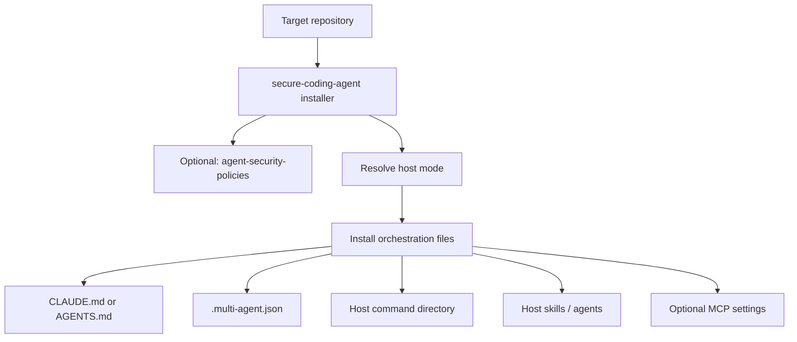
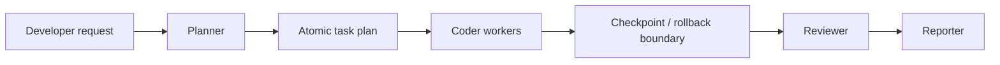

# Architecture

## Overview

Secure Coding Agent is a **security-first orchestration layer** for AI coding workflows.
It does not replace host runtimes such as Claude Code or OpenCode. It installs a structured operating model on top of them.

The architecture is intentionally simple:

1. **Install into an existing repo**
2. **Assign explicit roles to model CLIs**
3. **Run structured slash-command workflows**
4. **Preserve safety through checkpoints, rollback, and review**

This keeps the product useful as a real tool while making its design legible as an engineering artifact.

## Problem

AI coding CLIs are individually capable, but the default working model is weak:

- prompts drift over time
- review is inconsistent
- role boundaries are implicit
- safety mechanisms are ad hoc
- context sharing is not structured

Secure Coding Agent addresses that by installing:

- role configuration
- host-aware runtime defaults
- command-driven workflow entrypoints
- review and reporting conventions
- rollback-oriented operating safeguards

## Core Components

### 1. Installer layer

Two entrypoints install the system:

- TypeScript CLI: `npx secure-coding-agent`
- Bash installer: `./install.sh`

Responsibilities:

- bootstrap orchestration files into a target repo
- resolve the target host (`claude-code`, `opencode`, or `opencode-omo`)
- optionally call `agent-security-policies`
- keep installation idempotent
- install only the contract files required to operate the workflow

### 2. Role configuration

`.multi-agent.json` is the runtime contract for agent orchestration.

It defines:

- host mode
- optional `.secure-coding/` persistence policy
- roles
- CLI adapters
- model mappings
- checkpoint strategy

This is the main abstraction that makes the system configurable without rewriting prompts or commands.

### 3. Command layer

Workflow commands act as the main entrypoints.
They are installed into a host-appropriate directory:

- `.claude/commands/` for `claude-code` and `opencode-omo`
- `.opencode/command/` for plain `opencode`

Stable commands:

- `/plan`
- `/code`
- `/review`
- `/report`
- `/full-cycle`
- `/checkpoint`
- `/rollback`
- `/roles`

Preview commands:

- `/lint`
- `/security-review`

The commands are deliberately file-based, because:

- they are transparent
- they are easy to inspect and version
- they preserve the repo as the product surface

### 4. Skills and host-specific agents

The installer can also place reusable skill and agent assets depending on the host:

- `create-skill` is installed as a reusable skill for all hosts
- OmO installs additional custom agents in `.claude/agents/`
- built-in OmO agents remain untouched; secure-coding-agent only adds complementary agents

### 5. Safety primitives

Safety is part of the architecture, not an add-on.

Current primitives:

- checkpoint creation before risky delegation
- rollback workflow
- role isolation
- review stage before final reporting

Planned primitives:

- cache-aware review
- richer policy-aware execution
- MCP-backed shared context

## Installation Flow

## Runtime Flow

## Trust Boundaries

This project has four practical trust boundaries:

### Developer input

The user request determines intent, scope, and task framing.
This is untrusted from a security modeling perspective because it can be ambiguous or incomplete.

### Local repository state

The target repository becomes execution context.
This includes code, configuration, existing prompts, and git state.

### External CLIs and model providers

Claude Code, OpenCode, Gemini CLI, and Codex are external execution surfaces with their own behavior, auth, and failure modes.

### Security tooling

Semgrep, Gitleaks, Trivy, and other scanners are external dependencies in the broader review workflow.

## Design Tradeoffs

### Why install files instead of running a hidden service

Chosen because:

- the installed repo is the product surface
- users can inspect everything
- trust is higher when the system is visible and understandable

Tradeoff:

- more documentation discipline is required

### Why role config lives in JSON

Chosen because:

- it is inspectable
- easy to edit
- simple to validate
- sufficient for current scope

Tradeoff:

- fewer expressive features than a richer DSL

### Why review is a first-class stage

Chosen because:

- the project is not trying to be “more autonomous”
- it is trying to be safer and more reproducible

Tradeoff:

- more steps than pure codegen workflows

## Current Architectural Limits

The current system is strong as a **workflow installer and orchestration contract**.
It is not yet a full runtime platform.

Current limits:

- command workflows depend on external CLIs being installed and authenticated
- OpenCode and OmO support are currently implemented as host-aware file installs, not as a separate runtime engine
- preview commands still rely on external scanners and local environment assumptions
- no schema validation for `.multi-agent.json` yet
- no full end-to-end test harness against all external tools

## Why this architecture matters

This project demonstrates:

- system design under real tool constraints
- product thinking applied to developer workflows
- security-centered workflow design
- clear tradeoffs between flexibility, transparency, and reliability
